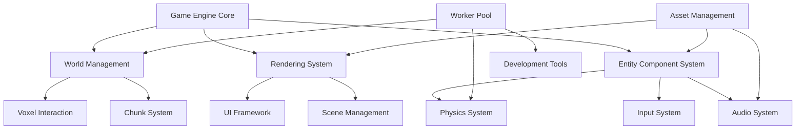

# Game Engine Enhancement Design Document

## Overview

This design document outlines the architecture for transforming the voxx-js voxel terrain engine into a comprehensive game development platform. The enhancement will build upon the existing Three.js foundation, chunk-based world management, and worker thread architecture while adding essential game development systems.

The design follows a modular, component-based architecture that integrates seamlessly with the existing codebase. All new systems will be designed to work with the current 32x256x32 chunk system, greedy meshing optimization, and multi-threaded terrain generation.

## Architecture

### Core Architecture Principles

1. **Modular Design**: Each system (ECS, Physics, Audio, etc.) is self-contained and communicates through well-defined interfaces
2. **Performance First**: Maintain the existing high-performance characteristics through efficient algorithms and worker thread utilization
3. **Backward Compatibility**: All enhancements integrate with existing World, Chunk, and rendering systems without breaking changes
4. **Extensibility**: Systems are designed to be easily extended and customized for different game types

### System Integration Flow



## Components and Interfaces

### 1. Entity Component System (ECS)

The ECS will be the central architecture for managing game objects, providing a flexible and performant way to compose entity behavior.

#### Core Classes

**EntityManager**
```javascript
class EntityManager {
  constructor()
  createEntity(): EntityId
  destroyEntity(entityId: EntityId): void
  addComponent(entityId: EntityId, component: Component): void
  removeComponent(entityId: EntityId, componentType: string): void
  getComponent(entityId: EntityId, componentType: string): Component
  hasComponent(entityId: EntityId, componentType: string): boolean
  getEntitiesWithComponents(...componentTypes: string[]): EntityId[]
}
```

**Component Base Class**
```javascript
class Component {
  constructor(type: string)
  serialize(): object
  deserialize(data: object): void
}
```

**System Base Class**
```javascript
class System {
  constructor(entityManager: EntityManager)
  update(deltaTime: number): void
  onEntityAdded(entityId: EntityId): void
  onEntityRemoved(entityId: EntityId): void
}
```

#### Built-in Components

- **Transform**: Position, rotation, scale in 3D space
- **Mesh**: Three.js mesh reference and material properties
- **RigidBody**: Physics properties (mass, velocity, forces)
- **Collider**: Collision shape and properties
- **AudioSource**: 3D audio properties and sound references
- **VoxelModifier**: Ability to modify voxel terrain
- **Health**: Health points and damage handling
- **Inventory**: Item storage and management

### 2. Physics Integration

The physics system will integrate with a lightweight physics engine (likely Cannon.js or Rapier) and work seamlessly with the voxel terrain.

#### PhysicsSystem Class
```javascript
class PhysicsSystem extends System {
  constructor(entityManager: EntityManager, world: World)
  update(deltaTime: number): void
  createRigidBody(entityId: EntityId, shape: CollisionShape): void
  updateVoxelCollisions(chunkX: number, chunkZ: number): void
  raycast(origin: Vector3, direction: Vector3, maxDistance: number): RaycastResult
}
```

#### Voxel Collision Integration
- Generate collision meshes from chunk voxel data
- Update physics world when voxels are modified
- Optimize collision detection using chunk-based spatial partitioning
- Handle water physics with buoyancy and fluid resistance

### 3. Voxel Interaction System

Extends the existing chunk system to support real-time voxel modification with proper mesh updates and persistence.

#### VoxelInteractionSystem Class
```javascript
class VoxelInteractionSystem extends System {
  constructor(entityManager: EntityManager, world: World, physicsSystem: PhysicsSystem)
  handleVoxelClick(screenPosition: Vector2, camera: Camera): void
  placeVoxel(worldPosition: Vector3, blockType: number): boolean
  destroyVoxel(worldPosition: Vector3): boolean
  getVoxelAt(worldPosition: Vector3): { blockType: number, chunkCoords: Vector2 }
}
```

#### Mesh Update Strategy
- Batch voxel modifications to minimize mesh regeneration
- Use worker threads for mesh regeneration to avoid main thread blocking
- Implement dirty chunk tracking for efficient updates
- Handle cross-chunk boundary updates automatically

### 4. Audio System

3D positional audio system built on Web Audio API with integration to the ECS.

#### AudioSystem Class
```javascript
class AudioSystem extends System {
  constructor(entityManager: EntityManager, camera: Camera)
  playSound(entityId: EntityId, soundId: string, options: AudioOptions): void
  playMusic(musicId: string, options: MusicOptions): void
  updateListenerPosition(position: Vector3, orientation: Vector3): void
  setMasterVolume(volume: number): void
  setVolumeCategory(category: string, volume: number): void
}
```

#### Features
- 3D positional audio with distance attenuation
- Audio categories (SFX, Music, Voice) with independent volume controls
- Audio streaming for large music files
- Audio pooling for frequently played sounds
- Integration with asset management for audio loading

### 5. User Interface Framework

React-like component system for creating game UIs, integrated with Three.js rendering.

#### UISystem Class
```javascript
class UISystem {
  constructor(renderer: WebGLRenderer)
  createElement(type: string, props: object, ...children: UIElement[]): UIElement
  render(rootElement: UIElement): void
  handleInput(event: InputEvent): boolean
  setTheme(theme: UITheme): void
}
```

#### UI Components
- Panel, Button, Text, Image, ProgressBar
- Layout containers (HBox, VBox, Grid)
- Input components (TextField, Slider, Checkbox)
- Game-specific components (Inventory, Minimap, Chat)

### 6. Asset Management System

Centralized asset loading and caching system with Three.js integration.

#### AssetManager Class
```javascript
class AssetManager {
  constructor()
  loadTexture(path: string): Promise<Texture>
  loadModel(path: string): Promise<Group>
  loadAudio(path: string): Promise<AudioBuffer>
  loadJSON(path: string): Promise<object>
  preloadAssets(assetList: string[]): Promise<void>
  dispose(assetId: string): void
  getMemoryUsage(): MemoryStats
}
```

#### Caching Strategy
- LRU cache with configurable memory limits
- Automatic disposal of unused assets
- Asset dependency tracking
- Progressive loading with priority queues

### 7. Scene Management

Hierarchical scene system for organizing game content and managing transitions.

#### SceneManager Class
```javascript
class SceneManager {
  constructor(entityManager: EntityManager, world: World)
  createScene(name: string): Scene
  loadScene(name: string): Promise<Scene>
  saveScene(scene: Scene): Promise<void>
  transitionToScene(sceneName: string, transition: TransitionType): Promise<void>
  getCurrentScene(): Scene
}
```

### 8. Input Management

Flexible input system with action mapping and context switching.

#### InputManager Class
```javascript
class InputManager {
  constructor()
  bindAction(actionName: string, inputBinding: InputBinding): void
  setInputContext(contextName: string): void
  isActionPressed(actionName: string): boolean
  isActionJustPressed(actionName: string): boolean
  getAxisValue(axisName: string): number
  update(): void
}
```

#### Integration with Existing Controls
- Extend PointerLockControls for camera movement
- Support multiple input contexts (Game, UI, Menu)
- Gamepad support with configurable mappings

### 9. Networking Foundation

Basic client-server networking with state synchronization.

#### NetworkManager Class
```javascript
class NetworkManager {
  constructor(isServer: boolean)
  connect(serverUrl: string): Promise<void>
  disconnect(): void
  sendMessage(messageType: string, data: object): void
  onMessage(messageType: string, handler: Function): void
  syncEntity(entityId: EntityId, components: string[]): void
}
```

### 10. Performance Optimization

Enhanced performance monitoring and optimization systems.

#### PerformanceManager Class
```javascript
class PerformanceManager {
  constructor()
  startProfiling(category: string): void
  endProfiling(category: string): void
  getFrameStats(): FrameStats
  getMemoryStats(): MemoryStats
  optimizeForTarget(targetFPS: number): void
}
```

#### Optimization Strategies
- Extend existing WorkerPool for additional background tasks
- Implement object pooling for frequently created/destroyed objects
- Spatial partitioning for entity queries
- Automatic LOD adjustment based on performance

### 11. Development Tools

Enhanced debugging and development tools building on existing Stats.js integration.

#### DevTools Class
```javascript
class DevTools {
  constructor(engine: GameEngine)
  enableDebugOverlay(categories: string[]): void
  inspectEntity(entityId: EntityId): EntityInspector
  executeCommand(command: string): any
  enableHotReload(): void
  visualizeChunkBoundaries(enabled: boolean): void
}
```

## Data Models

### Entity Data Structure
```javascript
{
  id: "entity_123",
  components: {
    "Transform": { position: [0, 0, 0], rotation: [0, 0, 0], scale: [1, 1, 1] },
    "Mesh": { geometryId: "cube", materialId: "stone" },
    "RigidBody": { mass: 1.0, velocity: [0, 0, 0] }
  }
}
```

### Scene Data Structure
```javascript
{
  name: "main_scene",
  entities: [...],
  environment: {
    skybox: "sky_texture",
    lighting: { ambient: 0.7, directional: { intensity: 0.8, position: [5, 10, 7.5] } }
  },
  worldSettings: {
    renderDistance: 12,
    noiseSeed: 0.12345
  }
}
```

### Asset Manifest Structure
```javascript
{
  textures: {
    "stone": { path: "textures/stone.png", format: "PNG" },
    "grass": { path: "textures/grass.png", format: "PNG" }
  },
  models: {
    "tree": { path: "models/tree.gltf", format: "GLTF" }
  },
  audio: {
    "footstep": { path: "audio/footstep.ogg", format: "OGG" }
  }
}
```

## Error Handling

### Error Categories
1. **Asset Loading Errors**: Fallback to default assets, user notification
2. **Physics Errors**: Graceful degradation, entity cleanup
3. **Network Errors**: Reconnection attempts, offline mode
4. **Worker Thread Errors**: Task retry, worker pool recovery
5. **Memory Errors**: Automatic cleanup, performance warnings

### Error Recovery Strategies
- Automatic fallback systems for critical failures
- Graceful degradation of non-essential features
- User-friendly error messages with actionable solutions
- Comprehensive logging for debugging

## Testing Strategy

### Unit Testing
- Component serialization/deserialization
- System update logic
- Asset loading and caching
- Input handling and action mapping

### Integration Testing
- ECS system interactions
- Physics and voxel collision integration
- Audio system with 3D positioning
- UI system with input handling

### Performance Testing
- Frame rate stability under load
- Memory usage monitoring
- Worker thread efficiency
- Chunk loading/unloading performance

### Compatibility Testing
- Different browsers and devices
- Various screen sizes and resolutions
- Different input devices (keyboard, mouse, gamepad)
- Network conditions for multiplayer features

## Implementation Phases

### Phase 1: Core ECS and Integration
- Implement basic ECS architecture
- Integrate with existing World and Chunk systems
- Basic Transform and Mesh components
- Simple system update loop

### Phase 2: Physics and Voxel Interaction
- Physics system integration
- Voxel modification system
- Collision detection with terrain
- Basic player physics

### Phase 3: Audio and UI Systems
- 3D audio system implementation
- Basic UI framework
- Input management system
- Asset management foundation

### Phase 4: Advanced Features
- Scene management
- Networking foundation
- Performance optimization
- Development tools

### Phase 5: Polish and Optimization
- Comprehensive testing
- Performance tuning
- Documentation
- Example implementations

This design maintains the high-performance characteristics of the existing voxx-js engine while providing a comprehensive foundation for game development. The modular architecture ensures that features can be implemented incrementally without disrupting existing functionality.